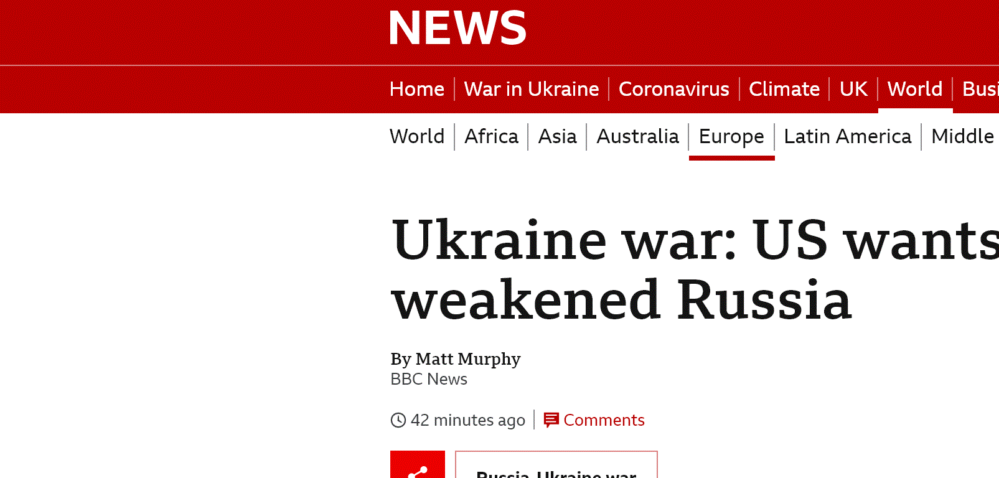

## work-in-progress

# News title cropper

A common thing seen in video essays and documentaries, is a clip/animation showing many news articles, centered around the specific word of interest. This is usually done manually in video editing software, where the editor takes many screenshots of news articles and meticulously aligns them to generate the video.

A clip from a [Vice news video](https://www.youtube.com/watch?v=bolyiGMcjBs&t=158s&ab_channel=VICENews)

Currently only supports BBC News

## Use:

    python main.py [-h] word numPages

## Example

    python main.py metaverse 1

## Results:

## Result with slow zoom:

## Ukraine result:

## Result from the Daily Mail:

# To-do:

- Add support for the Daily Mail and other news sources and
- Allow words to be found even if surrounded by punctuation, and crop accordingly
